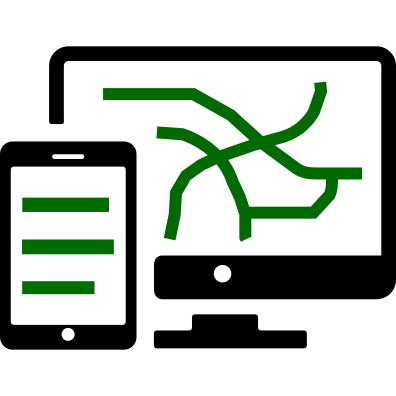
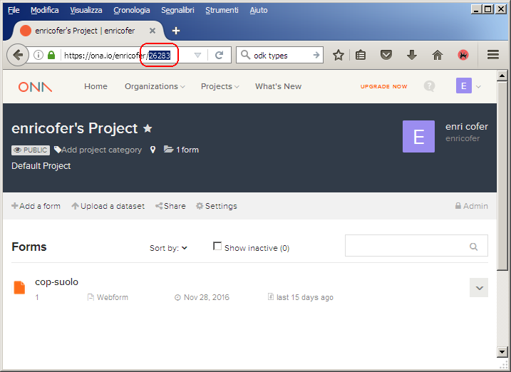
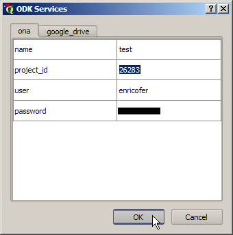
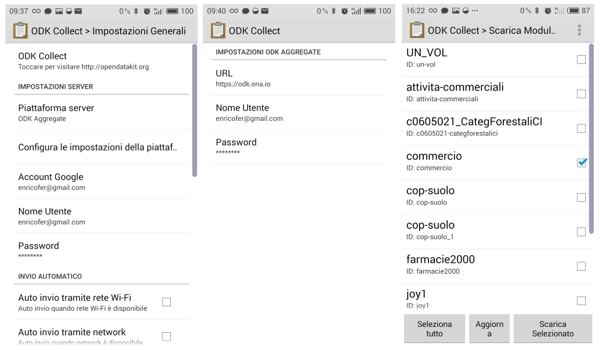
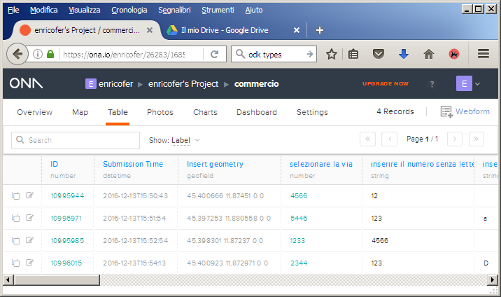
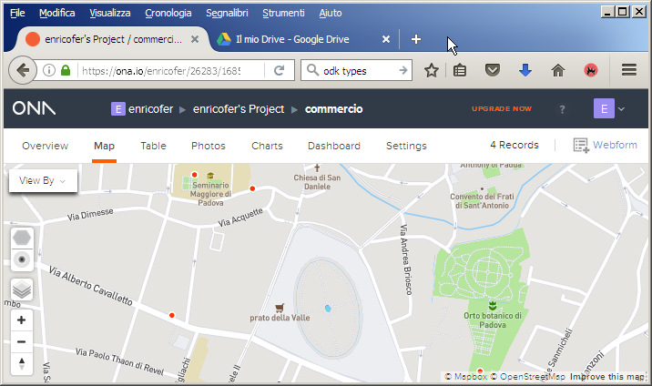
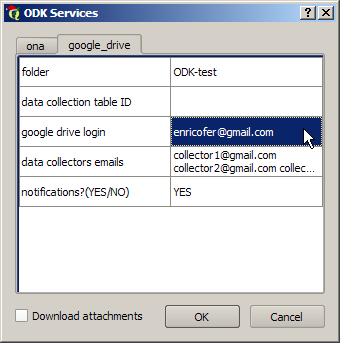
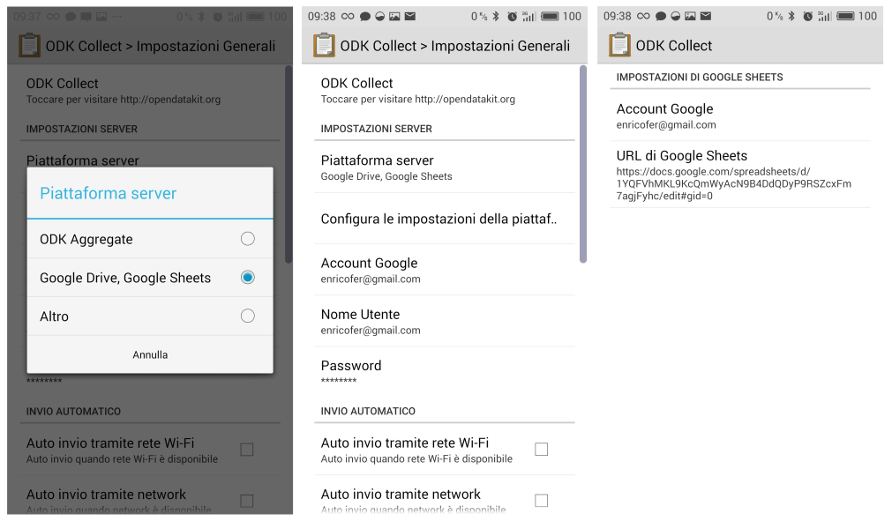
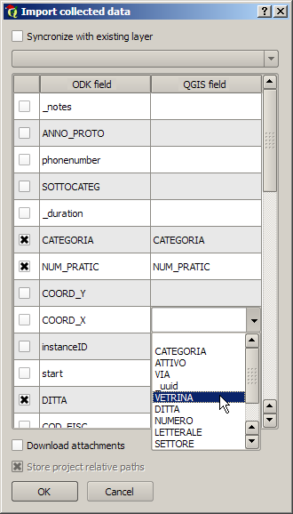

# QGISODK #

[1 about the plugin](#1-about-the-plugin)
[2 survey design from layer properties](#2-survey-design-from-layer-properties)
[3 the main dialog window](#3-the-main-dialog-window)
[4 Exporting the form](#4-Exporting-the-form)
[5 QGISODK and ona.io](#5-QGISODK-and-ona.io)
[6 QgisODK and google drive](#6-QgisODK-and-google-drive)
[7 Importing Collected Data](#7-Importing-Collected-Data)

##1 about the plugin
 

The QGIS plugin allows to build a "on field" mobile survey in few minutes starting from a QGIS layer and get back collected data with the help of Open Data Kit tools and services. 
[Open Data Kit (ODK)](https://opendatakit.org/) is a free and open-source set of tools which help to manage mobile data collection solutions. 

The typical ODK collection workflow is based on the following activities:

- survey form design (XlsForm/XForm)
- deployment of survey forms on ODK collect Android App 
- on field data collection by a mobile device
- data aggregation on server

The dedicated Android App suitable for ODK aggregate system is ODK collect and can be freely installed from [(Google play store)](https://play.google.com/store/apps/details?id=org.odk.collect.android&hl=it)

The QgisODK plugin generates forms (XlsForm/XForm) directly from loaded datasources converting the QGIS field Types to Odk Types according to QGIS Field Widget, upload ready to use forms to ODK aggregate server (at the moment the plugin supports ona.io and google drive) and retrieve collected data back to QGIS.

Let's follow a QGISODK survey from form creation to data retrieving

##2 survey design from layer properties 

Design layer properties structure editing the forms tab under qgis layer properties. In this tab fields can be added defining their data type. Furthermore each field can be associated with a specific "edit widget", the other field properties (comment, alias, WMF, WMS) are not significant for the QGISODK plugin. In this case the first field 'OBJECTID' is set to Hidden widget, the fields 'SETTORE' and 'CATEGORIA' are set to a Value Map widget, the fields 'VETRINA' and 'INSEGNA' are set to Photo widget and all the others are set to Text edit widget (default)

Switching to QGISODK from menu, toolbar or layer context menu appears the main dialog windows showing the field arrangement table and the function buttons. Together with layer fields are exported a geometry field needed for geolocation and a metadata field set, containing some autocompiled field related to submission and the collecting device.

The generated table is ready to be exported or submitted, but it can be edited to customize contents and behaviours of the ODK form. In this case fields with default Edit Widget (TextEdit widget) are casted to the respective ODK types: *integer*, *decimal*, *text* and *datetime*. The following table describes ODK types, or Question types as mentioned in ODK documentation:

| Question type  | Answer input  |
| -------------- | ------------- |
| integer        | Integer (i.e., whole number) input. |
| decimal        | Decimal input. |
| text | Free text response.</td> |
| select_one [options] | Multiple choice question; only one answer can be selected. | 
| select_multiple [options] | Not supported by QgisODK plugin. |
| note | Not supported by QGISODK plugin | 
| geopoint | Collect a single GPS coordinates. |
| geotrace | Record a line of two or more GPS coordinates. |
| geoshape | Record a polygon of multiple GPS coordinates; the last point is the same as the first point.| 
| date | Date input. | 
| time | Time input. | 
| dateTime | Accepts a date and a time input. |
| image | Take a picture. | 
| audio | Take an audio recording. | 
| video | Take a video recording. | 
| barcode | Scan a barcode, requires the barcode scanner app to be installed. | 
| calculate | Not supported by QGISODK plugin | 
| acknowledge| Not supported by QGISODK plugin | 

further details on ODK types and their usage in <a href="http://xlsform.org/ref-table/">http://xlsform.org/ref-table/

##3 the main dialog window 

Fields associated to other Edit widgets are adapted to specific ODK types: CheckBox and ValueMap widgets are converted in *select one* ODK type translating the user defined values into ODK *choices*. Hidden edit widget are imported as disabled fields.
Different ODK types define different behaviours in survey forms once imported in mobile device. [Here](https://opendatakit.org/help/form-design/examples/) are reported examples the results in the mobile device for each ODK type prompt.

Each field is organized in colums: 

- **the field name** the draggable and collapsible field item, can be dragged to change the survey order or dropped with other fields in group items to generate compacted forms. Each field has several properties:
- **enabled** to include exclude field from the generated form
- **map to** to link ODK field to QGIS field making possible syncronization of collected data
- **label** to insert a friendly answer for the survey field. If leaved blank the field name is uses as label
- **ODK type** the question type for the survey field, see the next table for all ODK types
- **hint** to show a hint to help filling the field
- **required** to set mandatory fields, that are required to close and record the form
- **default** to set the field to a predefined value
- **choiches** to define *select one* value/label table
- **appearance** to define different behaviors of the survey field in the app, depending from ODK type.

From the main dialog window other functions can be accessed:

- Select a new layer to export as ODK form
- Adding/removing new fields and groups in 
- Open/Save the current dialog state as ODK project file
- Setting plugin and web services preferences
- export form to XlsForm file or Xform file
- upload form to current web service
- download collected data from current web service

Survey fields can be reordered and rearranged in groups dragging and dropping table items.
In this example three new groups have been created: DATI GENERALI, CLASSIFICAZIONE e MEDIA.
Single items are showed one by one in mobile app, while grouped items are showed as more compact stacked lists, useful to organize survey in thematic and subsequent steps.

##4 Exporting the form

Once organized and rearranged survey fileds, they can be exported for the deployment in the collectors devices. The plugin can export XForm for the direct copy on mobile devioce, XlsForm, which is indeed an Excel spreadsheet and can be directy modified furthermore to implement ODK feature not yet implemented by the plugin or uploaded manually to a ODK-aggregate server that could be installed by the user ([ODK-aggregate](https://opendatakit.org/use/aggregate/) or [FormHub](https://github.com/SEL-Columbia/formhub)), to a ODK cloud server ([ona.io](http://www.ona.io/), [SurveyCTO](http://www.surveycto.com/), a discontinued [FormHub](http://formhub.org/), etc ) or directy upload/download to personal Google Drive/Sheets 

At the moment the plugin supports ona.io, with direct simple http authentication and google drive with OAuth2 authentication

##5 QGISODK and ona.io

Ona.io is a complete ODK-aggregate service that offers at the moment a free access for 1 private form and for unlimited public forms. The users, the survey admin and the other contributors must sign up to ona.io and subscribe an account. Furthermore survey project have to be shared among data contributors giving proper permissions (can submit, can admim, can edit ...).  Once logged in we must annotate the project ID used for forms uploading that can be retrieved from the project URL. In this case the project ID of the project is 26283:

At this point the we can setup the plugin opening the setting dialog and inserting the project name, the project ID, the ona.io credentials and conferming with OK at the end:

We are ready now to export the form to ona web service pushing on "export to web service" button on main dialog. If everithing goes right we will get a new form, called as the Qgis layer.

We can now start to collect data using Enketo smart page, a web application integrated in ona.io or by ODK-collect android app once configured with the correct ona.io credentials: https://help.ona.io/guides/data-collection/ and start collecting data with mobile device

As the collectors send back collected data ona.io database is updated:

We are now ready to retrieve data to QGIS pushing "import collected data" button.
The requested data are enriched with a set of metadata related to survey, as submission time, instance UUID to avoid data replication, and geometry fields.

##6 QgisODK and google drive

As alternative to Ona.io, QGISODK plugin can use Google drive as support server. In this case the export/import procedure is slightly different. Google drive tab has to be fill and set:

The required parameters helps survey administrator to share forms and import collected data.

- *folder*: if filled the plugin will export forms in the suggested root subfolder
- *data collection table ID*: contains the google sheet ID, can be optionally filled to give an alternative data collection endpoint to the one automatically provided by plugin
- *google drive login*: the admin google drive login. It will be used for autofill user login in OAuth2 google authenthication
- *data collectors emails*: a space separated emails of involved collectors. The plugin will automatically share *folder* and all needed files (forms and data collection table) with all the suggested google drive users
- *notifications?*: if YES the plugin will send by the supplied admin google login an email message with all needed settings for *ODK collect* Android App

Pushing "export to web service" button in main dialog, the user will be prompted for google authentication, once authorized the plugin will upload Survey XForm (xml) to google drive in the *folder* specified in plugin settings under google drive tab, if not specified a *data collection table ID* will create a new void data collection table in the same folder of the setting tab and will share all these documents with the users provided in *data collectors emails* field. The URL of the newly created data collection table will be automatically embedded in XForm as *submission_url* giving a default endpoint to collected data in Adroid device.

*ODK collect* App has to be configured for Google drive:

##7 Importing Collected Data

Once survey activity started, the survey admin can import collected data pushing on "import collected data" button. The user select the available table to be imported (only with Ona.io) then configure import parameters in the data in the "import collected data" dialog.

The table can be simply imported or syncronized with an existing layer. In the first case a new layer will be created, in the latter data in the existing layer will be integreted with new data from odk provider. In this case the layer will be set to edited and charged with the new features. A new field called "ODK-UUID" is appended to QGIS Table allowing check to avoid duplicate data.
The first colums of the table enable or disable importing of the field on the right, the second column report all available ODK fields and the third one report the correspondant Qgis field if found. Doing so ODK fields can be mapped to existing Qgis fields.
The last feature option is the ability to download locally the files attached to the survey forms such as images, signatures, videos or audios. The local path can be stored as absolute paths or relative to the project one.