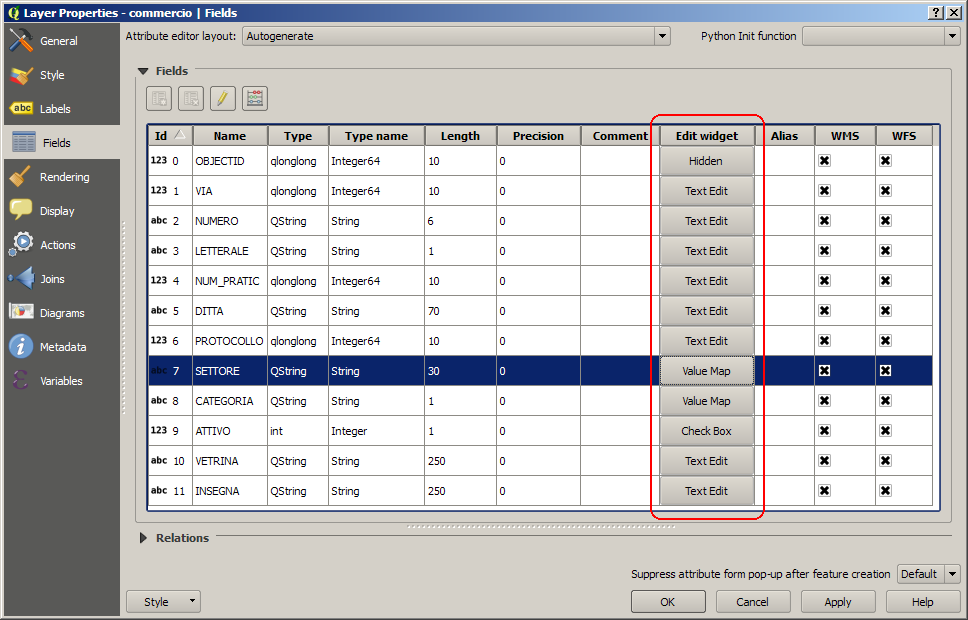

# QgisODK #

The Qgis plugin is aimed to integrate Open Data Kit tools and services in QGis to facilitate on the field data collection.
[Open Data Kit (ODK)](https://opendatakit.org/) is a free and open-source set of tools which help to manage mobile data collection solutions. The typical ODK collection workflow is based on the following activities:

- survey form design (XlsForm/XForm)
- on field data collection by a mobile device [(Google play store)](https://play.google.com/store/apps/details?id=org.odk.collect.android&hl=it)
- data aggregation on server

The QgisODK plugin generates forms (XlsForm/XForm) directly from loaded datasources converting the Qgis field Types to Odk Types according to Qgis Field Widget, upload ready to use forms to ODK aggregate server (at the moment the plugin supports ona.io and google drive) and retrieve collected data back to QGis.

Let's follow a QgisODK survey from form creation to data retrieving

## 1 survey design from layer properties ## 

Design layer properties structure editing the forms tab under qgis layer properties. In this tab fields can be added defining their data type. Furthermore each field can be associated with a specific "edit widget", the other field properties (comment, alias, WMF, WMS) are not significant for the Qgis ODK plugin. In this case the first field 'OBJECTID' is set to Hidden widget, the fields 'SETTORE' and 'CATEGORIA' are set to a Value Map widget, the fields 'VETRINA' and 'INSEGNA' are set to Photo widget and all the others are set to Text edit widget (default)

Switching to QgisODK from menu, toolbar or layer context menu appears the main dialog windows showing the field arrangement table and the function buttons. Together with layer fields are exported a geometry field needed for geolocation and a metadata field set, containing some autocompiled field related to submission and the collecting device.

The generated table is ready to be exported or submitted, but it can be edited to customize contents and behaviours of the ODK form. In this case fields with default Edit Widget (TextEdit widget) are "type casted" in ODK form with the respective ODK types: *integer*, *decimal*, *text* and *datetime*. Fields associated to other Edit widgets are adapted to specific ODK types: CheckBox and ValueMap widgets are converted in *select one* ODK type translating the user defined values into ODK *choices*. Hidden edit widget are imported as disabled fields.
Different ODK types define different behaviours in survey forms once imported in mobile device. [Here](https://opendatakit.org/help/form-design/examples/) are reported examples the results in the mobile device for each ODK type prompt.

The Main Fields table

